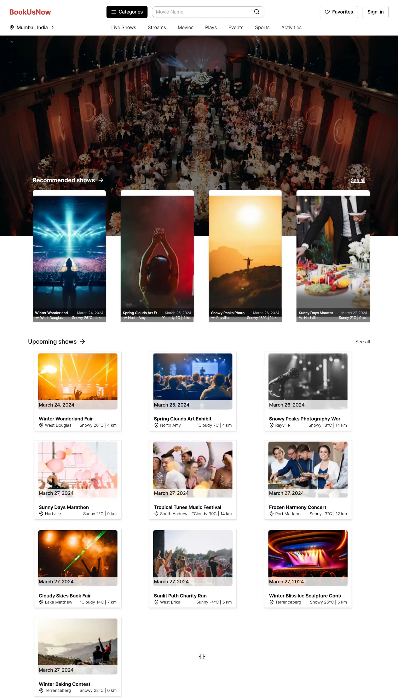
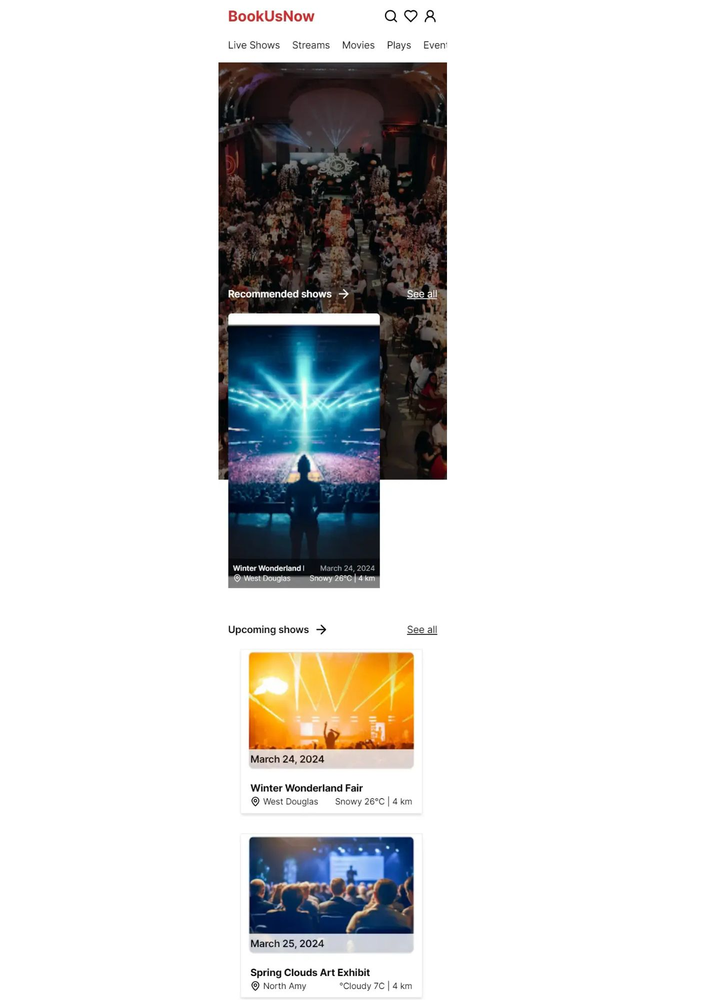

# BookusNow Event Project

## Introduction

Welcome to BookusNow, where you can explore upcoming and recommended events with ease! Our website offers a seamless experience across desktop and mobile screens, ensuring you never miss out on exciting happenings. Powered by cutting-edge event management APIs, we bring you a user-friendly interface for browsing and booking events effortlessly.

# BookusNow

## Technologies Used

- **React** ⚛️: Utilized for building the frontend, providing a dynamic and efficient user interface.
- **Axios** 📡: Used for making HTTP requests to fetch data from APIs.
- **Swiper** 🔄: Integrated for creating interactive and responsive sliders, enhancing user experience.
- **Lucide React** 💡: Used for icons, adding visual elements to the user interface.
- **React Infinite Scroll Component** 🔄: Implemented for infinite scrolling functionality, improving user experience when browsing events.

## Features

- **Responsive Design**: Our platform is optimized for both desktop and mobile browsers, ensuring a consistent experience across all devices.
- **API Integration**: We efficiently fetch and display data from a REST API, keeping our event listings up-to-date.
- **Horizontal Scrolling**: Our recommended events section features a horizontal scroll for easy navigation.
- **Lazy Loading**: Upcoming events are loaded dynamically as the user scrolls, reducing initial load times and improving performance.

## Preview

Desktop View

Mobile View


## Deliverables

- **Live Site**: (https://bookusnow-frontend.vercel.app/)
- **Source Code**: (https://github.com/Aditya-Deshmukh9/BookusNow-Frontend-Project)

## Installation

To get started with BookusNow, clone the repository and install the dependencies:

```bash
git clone https://github.com/Aditya-Deshmukh9/BookusNow-Frontend-Project.git
cd bookusnow
npm install
npm start

```

## Contributing

Contributions are welcome! Please feel free to submit a pull request or create an issue for any enhancements or bug fixes.

## License

BookusNow is open-sourced software licensed under the MIT license.

Remember to replace `https://github.com/Aditya-Deshmukh9/BookusNow-Frontend-Project.git` with the actual URL of your project repository. Also, you might want to add a `LICENSE` file to your repository if you haven't already. Happy coding! 😊
